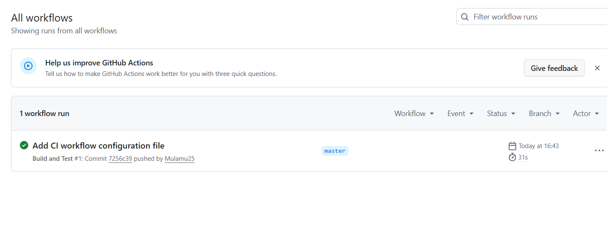

# CyberChatbot - Cybersecurity Awareness Bot

## Description
A commandline chatbot educates South African citizens about cybersecurity awareness.
This is Part 1 of a 3-part Portfolio of Evidence (POE).

### Features
-Voice greeting on launch
-ASCII art logo display
-Personalized conversations using the user's name(but not all the time)
-Cybersecurity topics: Purpose, Phishing, Safe browsing and Passwords
-Input validation 
-Colored console UI with borders
-Typing effect for realistic conversation feel

## How to Run
1. Clone the repository to your local machine.
2.Open in Visual Studio 
3.Press F5 to run

## Importtant: ASCII Art Display
If the ASCII art logo is not fully visible or appears cut off:
-Zoom in on your console window (press CTRL + Mouse scroll up)
-Or maximize the console window

## CI Status 

GitHub Actions CI workflow passes successfully

## Topics You can Ask About
- Purpose
- Phishing
- Safe Browsing
- Passwords

## Author
Mulamuleli Mungadi
st10498756

## References 

Pieterse, H. 2021. The Cyber Threat Landscape in South Africa: A 10-Year Review. *The African Journal of Information and Communication*, 28(28). 